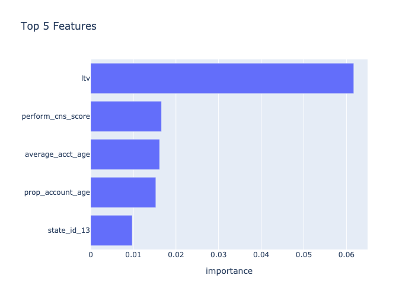
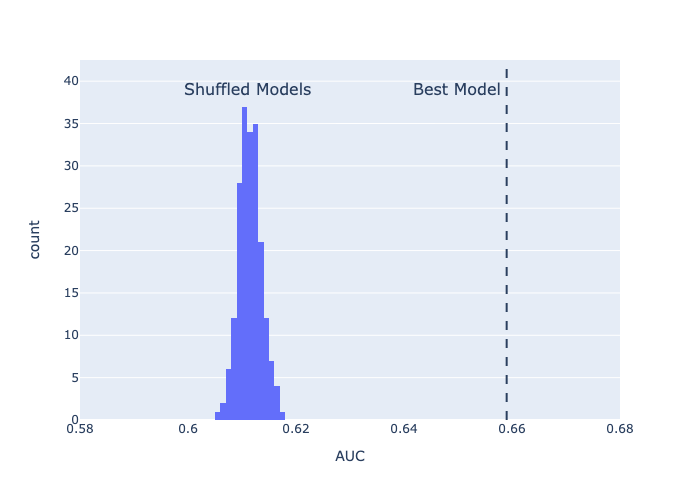

# Predicting median housing prices in Boston

 

## Objective
The objective is to predict median home prices in Boston based on data published in 1978.  

The data was provided by U.S. Census service and obtained from the [StatLib Archive](http://lib.stat.cmu.edu/datasets/boston).  It has been used extensively throughout the literature to benchmark algorithms. The data was originally published by Harrison, D. and Rubinfeld, D.L. `Hedonic prices and the demand for clean air', J. Environ. Economics & Management, vol.5, 81-102, 1978. 

 

## Performance Measure
In order to measure the effectiveness of the model in predicting housing prices, we used root mean square error (RMSE).  RMSE is calculated by: 

1. calculating the sum the squared differences between the predicted (model) and observed (test set) values 
2. dividing #1 by the numer of observations
3. taking the square root of #2

 

## Key Findings

1. The final model achieved an RMSE of $2.8K on the training data and  $2.4K on the test (unseen) data
              
2. The most important features to predict price were
	* **lstat**:  percentage of lower status of the population 
	* **rm**: average numer of rooms per dwelling 

## Model Validation
In order to validate the model, we used target shuffling which shows the probability that the model's results occured by chance. 
    
    For 100K repititions:
        
        1. Shuffle the target 
        2. Fit the best model to the shuffled target (shuffled model)
        3. Make predictions using the shuffled model and score using RMSE
        4. Plot the distribution of scores 
 

Since the best model performed better than every target permutation model, there is a 0 in 100K probability that the model's results occured by chance

## Approach

The overall approach to building the pricing model:

1. Initial data exploration
2. Select modeling techniques
3. Split data into Train/Test
4. Build and analyze baseline models
5. Feature engineering
6. Build and analyze final models
7. Final predictions using test set

 

## Data Description

The original data are 506 observations on 14 variables. cmedv is the target variable

Variable | Description | Modeled
---- | ----------- | --- 
crim |	per capita crime rate by town | yes
zn |	proportion of residential land zoned for lots over 25,000 sq.ft | yes
indus	| proportion of non-retail business acres per town | yes
chas |	Charles River dummy variable (= 1 if tract bounds river; 0 otherwise) | yes
nox	| nitric oxides concentration (parts per 10 million) | yes
rm	| average number of rooms per dwelling | yes
age	| proportion of owner-occupied units built prior to 1940 | yes
dis	| weighted distances to five Boston employment centres | yes
rad	| index of accessibility to radial highways | yes
tax	| full-value property-tax rate per USD 10,000 | yes
ptratio	| pupil-teacher ratio by town | yes
b	1000(B - 0.63)^2 | where B is the proportion of blacks by town | yes
lstat	| percentage of lower status of the population | yes
medv	| median value of owner-occupied homes in USD 1000's | no
cmedv	| corrected median value of owner-occupied homes in USD 1000's | yes
town	| name of town | no
tract	| census tract | no
lon	| longitude of census tract | yes
lat	| latitude of census tract | yes

 

## Potential Model Improvements

1. Interactions were not explicitly modeled.  The one way interactions between the top 5 important features could be enumerated to see if there is any improvement in the model.
2. No feature selection was performed.  There is a possibility that we could achieve similiar model performance using a reduced set of features. 

 
